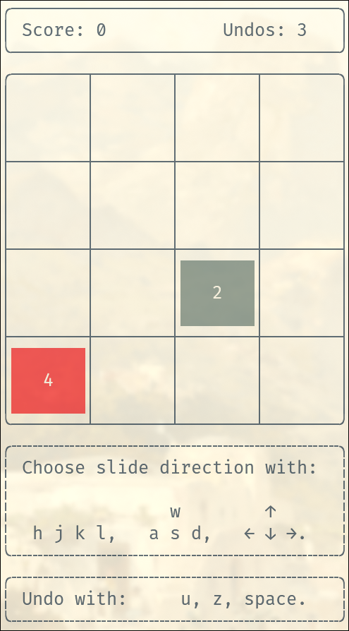
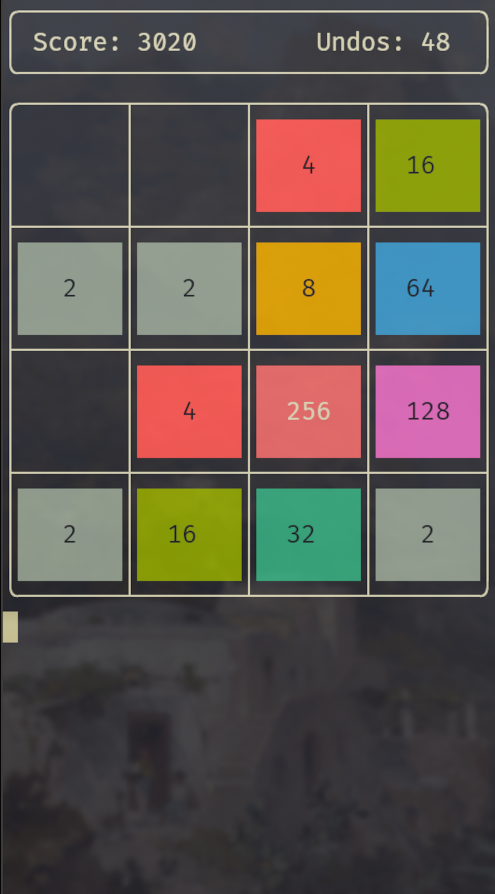

# 2048-tui

A simple terminal-based 2048 game written in C that uses the built-in 16-color scheme.

 

## Dependencies

- **ncurses** 

On Arch:
```sh
$ sudo pacman -S ncurses
```

On Debian/Ubuntu:
```sh
$ sudo apt install libncurses5-dev
```

## Build and Install

```sh
$ make
$ sudo make install
```

To uninstall:
```sh
$ sudo make uninstall
```

## Usage

Run the game with:
```sh
$ 2048-tui
```

### Flag options

- `-d n`, `--dimension n`  
Set the board size (minimum is 3, default is 4).  
Example:  
```sh
$ 2048-tui --dimension 5
```

- `-u n`, `--undos n`  
Set the number of allowed undos (minimus is 0, default is 3).  
Example:  
```sh
$ 2048-tui --undos 10
```

You can also combine both options:
```sh
$ 2048-tui -d 5 -u 10
```
